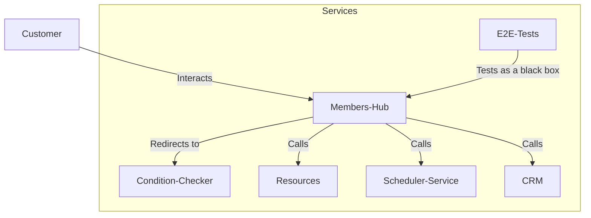

# Rowing Members Hub

## Overview

This series of microservices is an automation system designed to replace manual services at the rowing club. It centralises various functionalities, such as:
* Storing rower details
* Creating and managing schedules
* Providing training plans
* Checking conditions for rowing
* Integrating with a CRM for member management

This project is being developed using modern web technologies to enhance efficiency and improve user experience. The system comprises multiple services that interact with each other to streamline rowing club operations.

## System Architecture

Below is a Mermaid diagram representing the interactions between the various services in the Rowing Members Hub ecosystem:

Services
* [Members Hub](https://github.com/mrc-rowers-hub/mrc-members-hub): The frontend application where users interact with the system.
* [Condition Checker](https://github.com/mrc-rowers-hub/mrc-condition-checker): A service that provides real-time rowing conditions.
* [CRM](https://github.com/mrc-rowers-hub/mrc-crm): Manages rower details and membership data.
* [Scheduler Service](https://github.com/mrc-rowers-hub/mrc-scheduler-service): Handles scheduling and event organization.
* [Resources](https://github.com/mrc-rowers-hub/mrc-resources): Provides additional materials, such as training plans.
* [E2E Tests](https://github.com/mrc-rowers-hub/mrc-e2e-tests): Tests the entire system from an external perspective, simulating real user interactions.

This project ensures a seamless and automated experience for rowing club members, improving operational efficiency and accessibility.